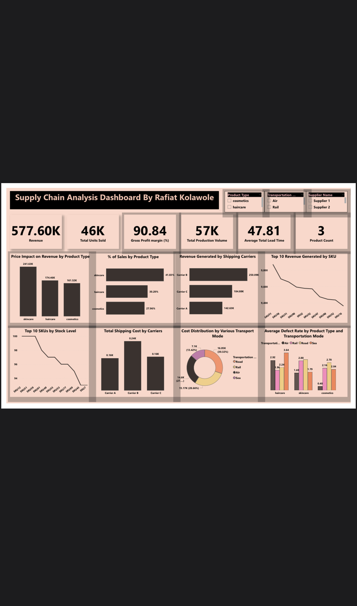

# Supply Chain Performance Analysis 

## Project Overview
This project analyzes supply chain performance across product categories, logistics channels, and inventory operations to uncover patterns that influence revenue, product quality, and operational efficiency.

## Tools Used
- Power BI
- Data Cleaning & Transformation
- Data Modeling
- Data Visualization
- KPI Analysis

## Key Performance Indicators
- Revenue
- Units Sold
- Profit Margin
- Production Volume
- Average Lead Time
- Product Count

## Analytical Focus Areas
- Price impact on revenue by product category
- Sales contribution across cosmetics, skin care, and hair care
- Revenue performance by shipping carrier
- Top-revenue and top-stock SKUs
- Shipping cost breakdown
- Transport mode cost distribution
- Defect rates by transport mode and product category

## Key Insight
Transportation mode significantly impacts product quality:
- Hair care products experienced the highest damage rates via **sea transport**, while **rail** performed best.
- For skin care and cosmetics, **road transport** recorded the highest defect rates, while **air transport** was consistently the safest.

## Business Impact
This analysis highlights how logistics and transportation decisions affect costs, product quality, and customer satisfaction. The dashboard helps identify:
- High-value products
- Cost-intensive logistics operations
- Opportunities for operational efficiency
- Areas requiring improvements in packaging or transportation processes

## Conclusion
The project demonstrates how supply chain analytics can drive better operational decisions by balancing cost, quality, and efficiency across the supply chain.

## Dashboard Preview

